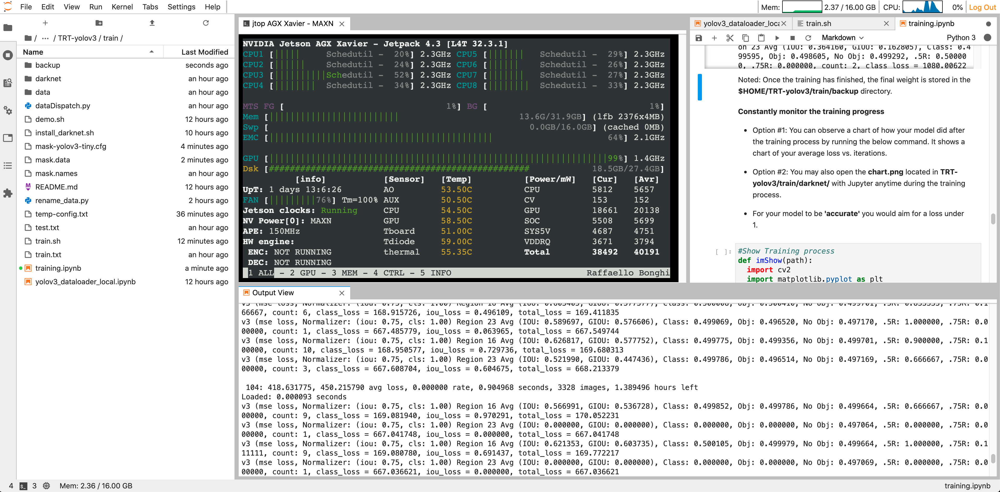

# Yolov3 Dataloader (Local Machine)


*** Author: Kevin Yu (www.github.com/yqlbu)

*** Email: kevinyu211@yahoo.com

- This tool is tailored for those who want to train their custom dataset on a Yolov3 Model. 

- Make sure you read the instructions in the **training.ipynb** for each step carefully !!!

- If you following the instructions below step by step, it will generate a new trained-weight in the end, and you are able to re-build the model with TensorRT Engine.

- Make sure you open Jupyter Notebook or JupyterLab at **/TRT-yolov3** directory.

Table of Contents
-----------------

* [Demo](#demo)
* [Train Model](#train-model)
* [Export Model](#export-model)
* [Build Engine](#build-engine)

Demo
----

Hardware specs and training params: 

- Device Name: NVIDIA Jetson AGX Xavier DevKit
- Memory: 32G
- Model: YOLOv3-tiny (Mask dataset)
- Batch: 32 (recommended)
- Subdivisions: 4 (recommended)
- Maxbatches: 5000 epoches
- Number of classes: 2
- Total training time: 1.5 hrs



<a name="demo"></a>

Train Model
-----------

The detailed steps are all demonstrated in the **[TRT-yolov3/train/training.ipynb](https://github.com/yqlbu/TRT-yolov3/blob/master/train/training.ipynb)**, if you carefully read and properly follow the steps, you should be able to train a YOLOv3 with your custom dataset.

Once the training starts, You may open **[TRT-yolov3/train/show_progress.ipynb](https://github.com/yqlbu/TRT-yolov3/blob/master/train/show_progress.ipynb)** notebook to constantly observe the progress.

Once the training has finished, the final weight is stored in the **TRT-yolov3/train/backup directory**.

**Notes:**

As for now, the training module only supports **YOLOv3-tiny** model. The normal YOLOv3-model support will be added soon.

<a name="train-model"></a>

Export Model
------------

- Copy & Paste the **final weight** (the one with **final**) from **TRT-yolov3/train/backup/** to **TRT-yolov3/yolov3_onnx/**
- Copy $ Paste the **.cfg** file from **TRT-yolov3/train/backup/** to **TRT-yolov3/yolov3_onnx/**

<a name="export-model"></a>

Build Engine
----------------

<a name="build-engine"></a>

#### Step #0: Rename Model

Rename your model(xxx_final.weights) and config (.cfg) in the format of **yolov3-xxx-tiny.weights** and **yolov3-xxx-tiny.cfg**

#### Step #1: Modify Config

Edit .cfg file, modify the following content

from:

```
[net]
# Testing
#batch=1
#subdivisions=1
# Training
batch=32
subdivisions=4
```

to:

```
[net]
# Testing
batch=1
subdivisions=1
# Training
# batch=64
# subdivisions=2
```

#### Step #2: Modify Contents

In **/yolov3_to_onnx/yolov3_to_onnx.py**:

- Modify **output_tensor_dims**. You should replace 255 with the proper number for your model. Code: [https://github.com/yqlbu/TRT-yolov3/...](https://github.com/yqlbu/TRT-yolov3/blob/93e086c21424b652bf4f0076639982e496bbafc5/yolov3_onnx/yolov3_to_onnx.py#L764)
- Add your model to the model list. Code: [https://github.com/yqlbu/TRT-yolov3/...](https://github.com/yqlbu/TRT-yolov3/blob/93e086c21424b652bf4f0076639982e496bbafc5/yolov3_onnx/yolov3_to_onnx.py#L738)

In **/utils/yolov3.py**:

- Modify **category_num** in **class PostprocessYOLO(object)** to match your class number. Code: [https://github.com/yqlbu/TRT-yolov3/...](https://github.com/yqlbu/TRT-yolov3/blob/93e086c21424b652bf4f0076639982e496bbafc5/utils/yolov3.py#L77)
- Modify **output_shapes** in class **TrtYOLOv3(object)**. For COCO, (80 + 5) * 3 = 255. For your own model, you need to replace 80 with your own number of classes. Code: [https://github.com/yqlbu/TRT-yolov3/...](https://github.com/yqlbu/TRT-yolov3/blob/93e086c21424b652bf4f0076639982e496bbafc5/utils/yolov3.py#L407)

In **/utils/yolo_classes.py**:

- Modify **COCO_CLASSES_LIST**, delete the COCO classes, and replaces with your class label. Code: [https://github.com/yqlbu/TRT-yolov3/...](https://github.com/yqlbu/TRT-yolov3/blob/93e086c21424b652bf4f0076639982e496bbafc5/utils/yolo_classes.py#L6)

In **detector.py**:

- Add your model to the model list. Code: [https://github.com/yqlbu/TRT-yolov3/...](https://github.com/yqlbu/TRT-yolov3/blob/93e086c21424b652bf4f0076639982e496bbafc5/detector.py#L32)

#### Step #3: Re-build TensorRT engine

YOLOv3 to ONNX
```bash
$ python3 yolov3_onnx.py --model new_model
# eg:
# python3 yolov3_onnx.py --model yolov3-mask-tiny-416
```

ONNX to TensorRT Engine
```bash
$ python3 onnx_to_tensorrt.py --model new_model
# eg:
# python3 onnx_to_tensorrt.py --model yolov3-mask-tiny-416
```

#### Inference

Specify the new added model for inference with the **--model** flag

```bash
$ python3 detector --usb --vid 0 --model new_model --runtime
```

Lisense
-------

[MIT License](https://github.com/yqlbu/TRT-yolov3/blob/master/LICENSE)